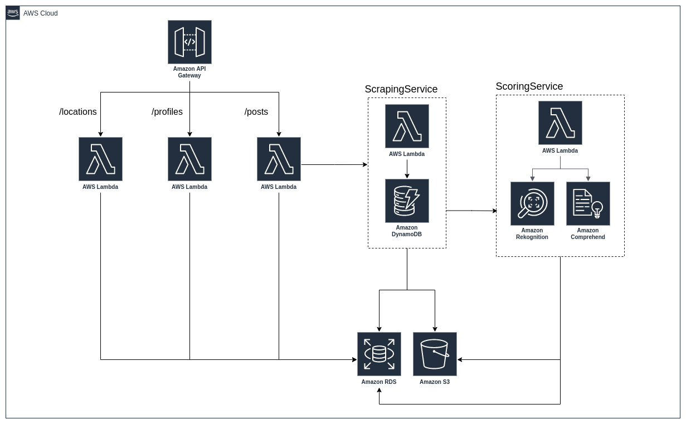
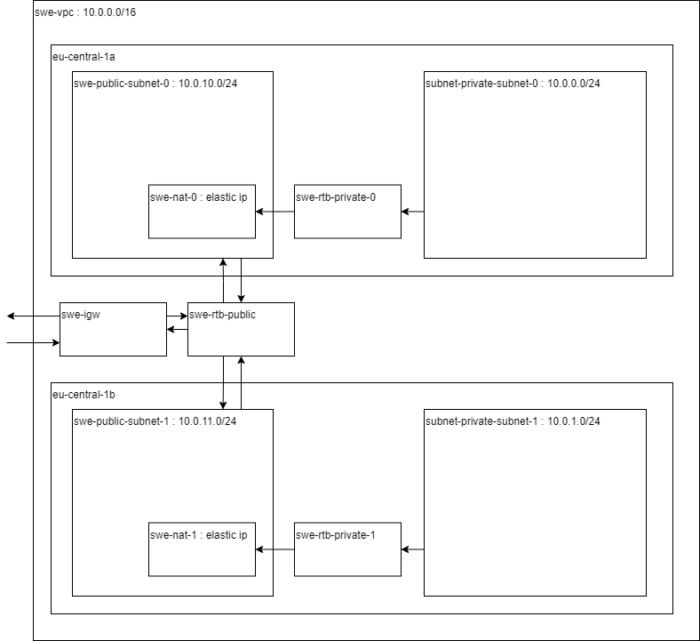

# Intro

Questo documento ha lo scopo di descrivere, ad alto livello, l'infrastruttura che verrà implementata per il *POC*.

# Infrastruttura

L'infrastruttura, appoggiandosi ad *AWS*, farà uso dei seguenti servizi:

- [Lambda](https://docs.aws.amazon.com/lambda/latest/dg/welcome.html)
- [S3](https://docs.aws.amazon.com/AmazonS3/latest/userguide//Welcome.html)
- [RDS](https://docs.aws.amazon.com/AmazonRDS/latest/UserGuide/Welcome.html)
- [DynamoDB](https://docs.aws.amazon.com/amazondynamodb/latest/developerguide/Introduction.html)
- [API Gateway](https://docs.aws.amazon.com/apigateway/latest/developerguide/welcome.html)
- [Rekognition](https://docs.aws.amazon.com/rekognition/latest/dg/what-is.html)
- [Comprehend](https://docs.aws.amazon.com/comprehend/latest/dg/what-is.html)
- [VPC](https://docs.aws.amazon.com/vpc/latest/userguide/how-it-works.html)

# Architettura

Verrà implementata un'architettura a *microservizi*. Ogni componente agisce all'interno del proprio ambiente di
esecuzione e comunica con le altre, quando serve, attraverso la rete.

## Servizi

I servizi qui brevemente descritti verranno implementati all'interno di funzioni *Lambda*. Una descrizione con maggiore
dettaglio è disponibile nella documentazione specifica ad ogni servizio.

### [ScrapingService](./services/scraping.md)

Esegue lo *scraping* dei dati di uno specifico account social e li memorizza in *RDS* (metadati come *geotag*, username,
...) e *S3* (file multimediali, quindi i post sotto forma di video o immagine). Si serve di *DynamoDB* per salvare la
sessione di autenticazione ed evitare continui login.

### [ScoringService](./services/scoring.md)

Analizza i dati predisposti da *ScrapingService* e applica uno *score*, servendosi dei servizi *Rekognition* e
*Comprehend*. Salva il risultato delle elaborazioni in *RDS*. Viene notificato di nuovi dati da analizzare in automatico.

## VPC

Questa architettura ha lo scopo di descrivere un'architettura cloud per l'accesso e la locazione all'interno di internet
delle risorse pubbliche e private del progetto.
Queste direttive verranno poi implementate in modo gestito dal servizio *AWS VPC*.
